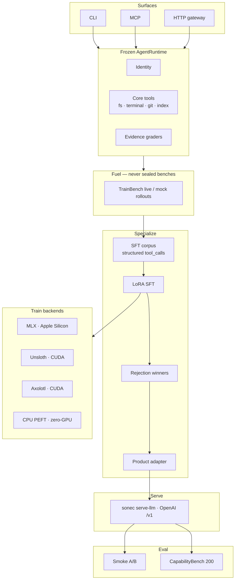
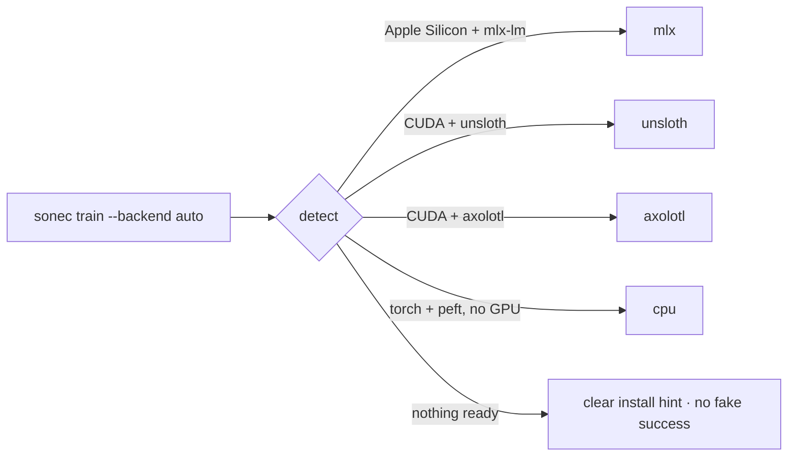

# sonec

<p align="center">
  
</p>

**sonec** by [Suryanshu Nabheet](https://github.com/Suryanshu-Nabheet) — LoRA specialization of **Qwen 3.5 2B** for tool-using software engineering.

Frozen harness. Evidence graders. Same tools and prompts as the base; **the weights are what change**.

<p align="center">
  <a href="https://github.com/Suryanshu-Nabheet/sonec/actions/workflows/ci.yml"></a>
  <a href="LICENSE"></a>
  <a href="pyproject.toml"></a>
  
  
</p>

---

## At a glance

| | |
| --- | --- |
| **Product** | Specialized LoRA adapter (not a Modelfile prompt) |
| **Serve** | `sonec serve-llm` → OpenAI-compatible `/v1` |
| **Base (product)** | `mlx-community/Qwen3.5-2B-4bit` / `Qwen/Qwen3.5-2B` |
| **Train backends** | MLX · Unsloth · Axolotl · CPU PEFT |
| **License** | Apache-2.0 — code, adapters, Qwen lineage ([NOTICE](NOTICE)) |
| **Published smoke** | sonec **8/8 @ ~8.5s** (2B board #1) |
| **Cap200** | Suite + harness shipped · **live scores not published yet** |

```bash
sonec weights          # ready=True  →  product adapters present
sonec doctor           # env + backend readiness
```

---

## Results

### Live agent A/B — published smoke (2026-07-19)

Suite: [`ab_agent_2b_hard.json`](examples/benchmarks/ab_agent_2b_hard.json) (8 tasks).

| Arm | Pass | Mean duration |
| --- | ---: | ---: |
| **sonec LoRA** | **8/8** | **8.6s** |
| Qwen3.5-2B base | 8/8 | 16.5s |

| 2B board | Pass | Mean duration |
| --- | ---: | ---: |
| **sonec** | **8/8** | **8.5s** |
| qwen3.5:2b | 8/8 | 11.5s |
| gemma2:2b | 0/8 | — |
| codegemma:2b | 0/8 | — |

Reports: [COMPARE_REPORT.md](docs/results/COMPARE_REPORT.md) · [LEADERBOARD.md](docs/results/leaderboard_2b/LEADERBOARD.md).

### CapabilityBench 200

Sealed **200** tasks (10 categories × 20). **Not** training fuel.

| Status | Detail |
| --- | --- |
| Suite | In-repo — [`capabilitybench_v1.json`](examples/benchmarks/capabilitybench_v1.json) |
| Live A/B | Hours on Apple Silicon / CUDA · **not published yet** |
| Gate | Promote adapters on Cap200 pass-rate lift (smoke is saturated) |

```bash
sonec capabilitybench
SKIP_SFT=1 ./scripts/capabilitybench_e2e.sh
```

### Weight-level specialization (NLL probe)

| Model | Mean token NLL (gold probe, n=8) |
| --- | ---: |
| Base `Qwen3.5-2B-4bit` | 2.159 |
| **sonec LoRA** | **0.022** |
| Δ | **−2.137 NLL** |

Source: [SFT_METRICS.json](docs/results/SFT_METRICS.json). NLL proves probe specialization; **live A/B / Cap200** is the skill gate.

---

## Architecture



| Layer | Job |
| --- | --- |
| **Harness** | Frozen tools + graders; success from workspace evidence |
| **Fuel** | Live / TrainBench only — sealed suites excluded |
| **Train** | Corpus → LoRA SFT → rejection winners |
| **Serve** | Base + adapter on `/v1` |
| **Eval** | Fair A/B; promote only on pass-rate lift |

Design: [docs/architecture.md](docs/architecture.md) · gate: [docs/GATE_REPORT_MODEL_STACK.md](docs/GATE_REPORT_MODEL_STACK.md)

---

## Install

```bash
git clone https://github.com/Suryanshu-Nabheet/sonec.git
cd sonec
python -m venv .venv
source .venv/bin/activate

pip install -e ".[dev]"          # always
# pick one train extra:
pip install -e ".[train]"        # Apple Silicon · MLX
pip install -e ".[train-cuda]"   # Linux NVIDIA · Unsloth
pip install -e ".[train-axolotl]"# Linux NVIDIA · Axolotl
pip install -e ".[train-cpu]"    # Zero-GPU · CPU PEFT proof

cp .env.example .env
sonec doctor
```

| Extra | Platform | Backend |
| --- | --- | --- |
| `.[train]` | Apple Silicon | MLX LoRA |
| `.[train-cuda]` | Linux + NVIDIA | Unsloth QLoRA (preferred CUDA) |
| `.[train-axolotl]` | Linux + NVIDIA | Axolotl QLoRA |
| `.[train-cpu]` | Any CPU | PEFT LoRA on small Qwen (pipeline proof) |

> **Honest note:** Product claims for **Qwen 3.5 2B** need MLX or CUDA adapters + Cap200. CPU PEFT uses a smaller base to prove the pipeline on machines without a GPU.

---

## End-to-end workflow

### 1. Specialize

```bash
# Preferred — live tool trajectories (needs a reachable inference server)
sonec train --step --live-fuel --sft-iters 300 --gold-n 0 --train-n 40

# Offline plumbing / CI / zero-GPU
sonec train --step --backend cpu --mock-fuel --sft-iters 40 --gold-n 32 --train-n 8

# Apple Silicon / CUDA product path
sonec train --step --backend auto --live-fuel --sft-iters 300

sonec weights   # ready=True
```

| Artifact | Meaning |
| --- | --- |
| `artifacts/train/fuel/rollouts.jsonl` | Graded rollouts |
| `artifacts/train/sft_corpus/mlx_data/` | Chat JSONL with real `tool_calls` |
| `artifacts/train/checkpoints/sonec-sft-{mlx,unsloth,axolotl,cpu}/` | LoRA adapters |
| `artifacts/train/PRODUCT.json` | Product manifest |
| `artifacts/train/TRAIN_REPORT.json` | Phase report |

### 2. Serve

```bash
# MLX product (Apple Silicon)
sonec serve-llm --port 8080

# PEFT product (Unsloth / Axolotl / CPU)
sonec serve-llm --backend peft --port 8080
```

```bash
export SONEC_BASE_URL=http://127.0.0.1:8080/v1
export SONEC_MODEL=<id advertised by the server>
```

### 3. Run

```bash
SONEC_BASE_URL=http://127.0.0.1:8080/v1 \
  sonec run "Fix the failing test" -w .
```

### 4. Evaluate

```bash
# Smoke (minutes) — published claim
sonec compare -s examples/benchmarks/ab_agent_2b_hard.json -o docs/results

# Cap200 (hours) — decision suite
SKIP_SFT=1 ./scripts/capabilitybench_e2e.sh
```

**Promotion rule:** keep an adapter when sealed Cap200 pass rate **exceeds** peers (or ties with clear speed + specialization), with no restraint regression.

---

## Training backends



| Backend | Command | Adapter dir |
| --- | --- | --- |
| MLX | `sonec train --step --backend mlx` | `…/sonec-sft-mlx` |
| Unsloth | `sonec train --step --backend unsloth` | `…/sonec-sft-unsloth` |
| Axolotl | `sonec train --step --backend axolotl` | `…/sonec-sft-axolotl` |
| CPU | `sonec train --step --backend cpu` | `…/sonec-sft-cpu` |

H2O LLM Studio: import `artifacts/train/sft_corpus/mlx_data/train.jsonl`.

Sealed suites (`capabilitybench`, `sonecbench`, `worldbench`, `ab_agent_*`) must **never** become training fuel.

---

## CLI reference

| Command | Purpose |
| --- | --- |
| `sonec version` | Package version |
| `sonec doctor` | Environment + weight readiness |
| `sonec weights` | Product adapter check |
| `sonec train` | Specialize LoRA (`--step`) |
| `sonec serve-llm` | Product inference (base + adapter) |
| `sonec serve` / `sonec mcp` | Harness HTTP / MCP |
| `sonec run` | Single agent goal |
| `sonec compare` | Fair A/B vs base |
| `sonec leaderboard` | Multi-model board |
| `sonec capabilitybench` | Generate Cap200 suite |
| `sonec rollout` | Collect graded trajectories |

```bash
sonec --help && sonec train --help
```

---

## Repository layout

```text
sonec/
├── sonec/                 # Agent · harness · train · eval · CLI
├── examples/benchmarks/   # Smoke · Cap200 · TrainBench
├── artifacts/train/       # Local fuel · corpus · checkpoints
├── docs/                  # Architecture · gates · results
├── scripts/               # overnight · Cap200 e2e · leaderboard
├── configs/               # SFT · RL · leaderboard arms
├── Modelfile              # Optional chat runner (not the product)
├── NOTICE                 # Qwen attribution
└── LICENSE                # Apache-2.0
```

Raw `*.safetensors` are gitignored. Reproduce with `sonec train --step`.

---

## Roadmap

**Landed**

- Live smoke A/B win vs base (speed + specialization)
- Structured OpenAI `tool_calls` SFT (text-shaped dumps rejected)
- Weight-level NLL proof on gold trajectories
- Live fuel + rejection winners in the train step
- Multi-backend train: MLX · Unsloth · Axolotl · CPU PEFT
- Production harness crash-safety + optional serve auth

**Next**

- Publish CapabilityBench 200 multi-model scores
- Promote adapters only on Cap200 pass-rate gates
- Scale live verified trajectories; keep sealed ids out of fuel

---

## Documentation

| Doc | Purpose |
| --- | --- |
| [Getting started](docs/getting-started.md) | Install → serve → smoke / Cap200 |
| [Architecture](docs/architecture.md) | Harness + train layout |
| [Training gate](docs/GATE_REPORT_MODEL_STACK.md) | Promote rules |
| [Training proof](docs/results/TRAIN_PROOF.md) | Published numbers |
| [Compare report](docs/results/COMPARE_REPORT.md) | Latest live A/B |
| [2B leaderboard](docs/results/leaderboard_2b/LEADERBOARD.md) | Multi-model smoke ranking |
| [SFT metrics](docs/results/SFT_METRICS.json) | NLL probe |
| [NOTICE](NOTICE) | Base weight lineage |

---

## License

**Apache License 2.0** © Suryanshu Nabheet.

Applies to sonec **source**, **documentation**, and **derived LoRA adapters**, consistent with **Qwen 3.5** (also Apache-2.0).

When redistributing adapters or checkpoints, include [LICENSE](LICENSE), [NOTICE](NOTICE), and Apache-2.0 text from the Qwen release if you also redistribute base weights.
